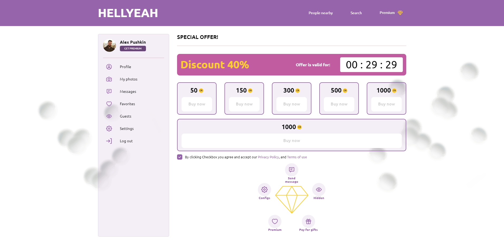

## Promo page

"Promo page" is a test task. Implemented such things as slider, timer, parallax, circle menu

This project  gave me experience at the following points: 

- Mobile first approach
- Using js libraries, such as "slick slider", "parallax.js", "jquery"
- Formatting code with prettier and eslint
- optimizing of images(webP, lazy load and other features)
- handling with svg style
	
 *Screenshots of the landing:* 

